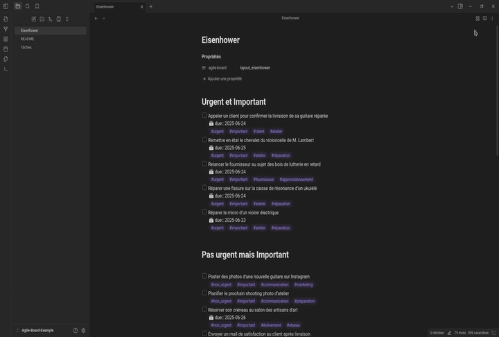
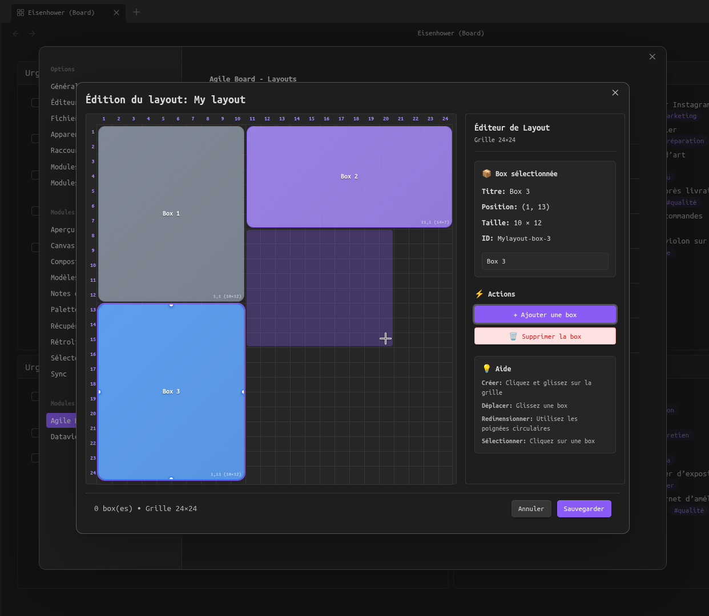

🌍 Lee esto en otros idiomas:
[English](README.md) | [Français](README.fr.md) | [Deutsch](README.de.md) | [Português](README.pt.md) | [简体中文](README.zh-CN.md) | [Русский](README.ru.md)

---

# Agile Board

**Agile Board** es un plugin para [Obsidian](https://obsidian.md) que transforma tus notas en tableros visuales.  
Cada disposición se basa en una plantilla (como la matriz Eisenhower) definida en una cuadrícula de 24×24.  
Las secciones aparecen como marcos editables ("boxes"): puedes escribir, insertar tareas, consultas de Dataview/Tasks, etc.

**Nota**: El contenido siempre se guarda en Markdown clásico bajo encabezados `#`, lo que garantiza la compatibilidad con todas tus notas.

---

## 🎯 Funciones

Transforma tus notas en paneles visuales con marcos editables.  
Cada marco representa una sección (encabezado de nivel 1) con soporte para:

- **Markdown enriquecido**: `[[enlaces]]`, `- [ ] tareas`, formato  
- **Edición inteligente**: listas auto-continuadas, casillas de verificación clicables  
- **Compatibilidad con plugins**: Dataview, Tasks, etc.  
- **Vista previa en vivo**: renderizado cercano a Obsidian con algunas limitaciones  

## 🌍 Soporte multilingüe

**NUEVO en v0.7.7**: Internacionalización completa con **detección automática de idioma**.

- 🇺🇸 **English** – idioma de referencia  
- 🇫🇷 **Français** – traducción completa  
- 🇪🇸 **Español** – traducción completa  
- 🇩🇪 **Deutsch** – traducción completa  
- 🇵🇹 **Português** – traducción completa  
- 🇨🇳 **中文 (简体)** – 完整翻译  

La interfaz se adapta automáticamente al idioma configurado en Obsidian.  
Todos los elementos de la interfaz, configuraciones, mensajes y tooltips están traducidos con **96 claves de traducción** en todos los idiomas.

## ⚠️ Limitaciones actuales

El modo tablero usa CodeMirror 6 para la edición pero no incluye todas las funciones avanzadas de edición de Obsidian:

- **Sugerencias de enlaces**: Al escribir `[[`, el editor no sugiere tus notas (aunque aún puedes escribir el enlace completo manualmente)
- **Llamadas a plugins en línea**: Las consultas en línea de Dataview (`= this.file.name`) o comandos de Templater (`<% tp.date.now() %>`) no se ejecutan en los marcos

### 📎 Soporte para Embeds

**NUEVO**: ¡La vista previa de embeds ahora es compatible en el modo tablero!

- **Imágenes**: `![[image.png]]` se muestra correctamente en el modo de vista previa
- **Notas**: `![[otra-nota.md]]` renderiza el contenido de la nota
- **Obsidian Bases**: `![[table.base]]` muestra vistas de base de datos interactivas

**Selección de vista persistente para Bases**: Para que la selección de vista en una base sea persistente, usa la sintaxis con fragmento:
```markdown
![[table.base#NombreDeLaVista]]
```
Esto asegura que la vista especificada se muestre siempre al cargar la nota.

## 🔄 Dos modos de visualización

**🏢 Modo Tablero**: Cuadrícula de marcos editables con funciones de vista previa en vivo  
**📄 Modo Normal**: Edición clásica de Markdown en Obsidian  

Cambia entre modos usando los íconos de la barra de herramientas.



---

## 🚀 Instalación

### Opción 1 – Vault completo (recomendado)

1. Descarga `Agile-Board-v0.7.7.zip` (Vault de Obsidian con plugin y ejemplos)  
2. Descomprime y abre la carpeta directamente en Obsidian  

### Opción 2 – Solo plugin

1. Descarga desde [GitHub releases](https://github.com/a198h/agile-board/releases)  
2. Copia la carpeta `agile-board` en `.obsidian/plugins/`  
3. Reinicia Obsidian y habilita el plugin  
4. **5 disposiciones predeterminadas incluidas**  

### Opción 3 – BRAT (Beta Testing)

Instala vía [BRAT](https://github.com/TfTHacker/obsidian42-brat) para obtener las últimas actualizaciones:

1. Instala y habilita el plugin BRAT  
2. Añade `a198h/agile-board` como plugin beta  
3. BRAT actualizará el plugin automáticamente  

---

## 📝 Uso

### Configuración

Para habilitar una disposición en una nota, agrega esta línea a las propiedades (frontmatter):

```yaml
---
agile-board: eisenhower
---
```

**Disposiciones disponibles** (incluidas por defecto):

- `eisenhower`: matriz de 4 cuadrantes importante/urgente  
- `swot`: analiza una situación  
- `moscow`: prioriza características o necesidades (Must/Should/Could/Won’t)  
- `effort_impact`: decide qué acciones tomar según efectividad  
- `cornell`: método Cornell para tomar notas activamente  

El ícono 🏢 aparece en la barra de herramientas. Haz clic para cambiar al modo tablero.

### Edición

- **Haz clic en un marco** → Modo edición  
- **Listas inteligentes**: listas con viñetas y numeradas  
- **Casillas de verificación**: clic para marcar/desmarcar, sincronización automática  
- **Consultas**: Query, Dataview, Tasks  

---

## ⚙️ Configuración del plugin

Desde **Configuración → Plugins de la comunidad → Agile Board** puedes gestionar tus disposiciones directamente en Obsidian.



### 📋 Gestión de disposiciones

La lista de disposiciones disponibles aparece automáticamente en la configuración.  
Cada disposición corresponde a un archivo `.json` guardado en la carpeta `layouts` del plugin (los usuarios no necesitan manipular esta carpeta).

- **Crear una disposición**: botón ➕, introduce un nombre  
- **Editar una disposición**: ícono ✏️ abre el editor visual  
- **Duplicar una disposición**: ícono 📑  
- **Exportar / Importar**: íconos ⬆️ y ⬇️ para compartir o cargar configuraciones  
- **Eliminar una disposición**: ícono 🗑️  

### 🎨 Editor visual

El editor de disposiciones muestra una **cuadrícula de 24×24**, donde puedes colocar **marcos**:

- **Crear**: haz clic y arrastra en la cuadrícula  
- **Mover**: arrastra un marco  
- **Redimensionar**: usa los controladores circulares  
- **Renombrar**: modifica el título en el panel lateral  
- **Eliminar**: botón rojo "🗑️"  
- **Eliminar todo**: botón rojo "🗑️ Clear all boxes" debajo de la sección de ayuda  

Cada marco corresponde a una **sección de nota**: un **encabezado de nivel 1** (`#`) seguido de su contenido.

---

## ✨ Características

- **Sincronización automática**: los cambios en los marcos se guardan automáticamente en el archivo Markdown  
- **Secciones automáticas**: creación asistida de secciones faltantes  
- **Compatibilidad con plugins**: Dataview, Tasks y Templater funcionan normalmente (¡informa bugs!); otros plugins por verificar  

---

## 💡 Inspiración

Este plugin se inspira en [Obsidian-Templify](https://github.com/Quorafind/Obsidian-Templify) y amplía el concepto de transformar notas Markdown en disposiciones visuales.

---

## 📂 ¡Tu contribución importa!

- **Bugs/Issues**: [https://github.com/a198h/agile-board/issues](https://github.com/a198h/agile-board/issues)  
- **Discusiones**: [https://github.com/a198h/agile-board/discussions/8](https://github.com/a198h/agile-board/discussions/8)  

## Apóyame
Si encuentras útil mi trabajo, puedes apoyarme aquí:  
[](https://ko-fi.com/a198h)
