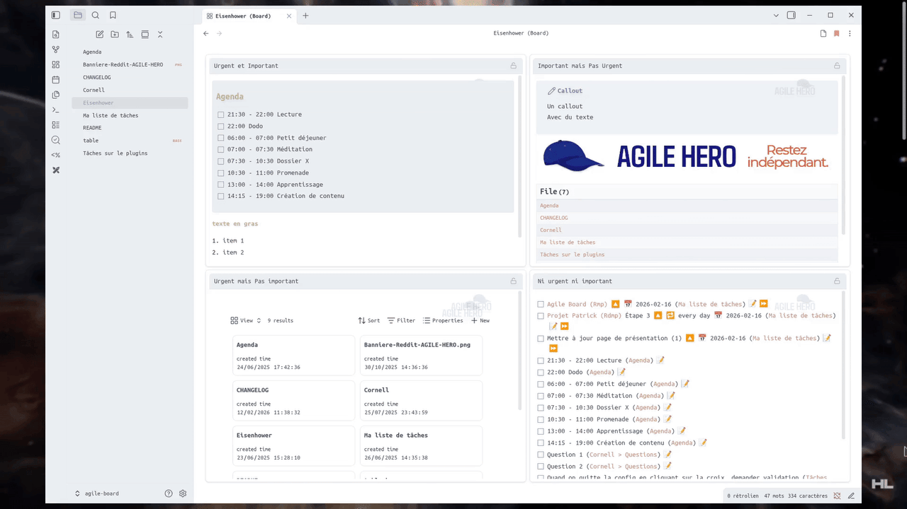

🌍 Read this in other languages:
[Français](README.fr.md) | [Español](README.es.md) | [Deutsch](README.de.md) | [Português](README.pt.md) | [简体中文](README.zh-CN.md) | [Русский](README.ru.md)

---

# Agile Board

**Agile Board** is a plugin for [Obsidian](https://obsidian.md) that transforms your notes into visual boards. Each layout is based on a template (like the Eisenhower matrix) defined on a 24x24 grid. Sections appear as editable frames ("boxes"): you can write, insert tasks, Dataview/Tasks queries, etc.

**Note**: Content is always saved in classic Markdown under # headings, which ensures compatibility with all your notes.

---

## 🎯 Features

Transform your notes into visual dashboards with editable frames. Each frame represents a section (level 1 heading) with support for:

- **Rich Markdown**: `[[links]]`, `- [ ] tasks`, formatting, horizontal lines, code blocks
- **Smart editing**: auto-continued lists, callouts, clickable checkboxes
- **Plugin compatibility**: Dataview, Tasks (with proper icon handling), etc.
- **Live Preview**: rendering close to Obsidian with enhanced markdown support
- **Frame lock**: Lock any frame to prevent accidental edits — links, embeds and checkboxes still work when locked
- **Font size**: Adjust text size across all frames (0.8× to 1.5×) from plugin settings


## 🌍 Multilingual Support

**NEW in v0.8.0**: Embed preview support and complete layout translations in 7 languages!

- 🇺🇸 **English** - reference language
- 🇫🇷 **Français** - traduction complète
- 🇪🇸 **Español** - traducción completa  
- 🇩🇪 **Deutsch** - vollständige Übersetzung
- 🇵🇹 **Português** - tradução completa
- 🇨🇳 **中文 (简体)** - 完整翻译

The interface automatically adapts to your Obsidian language setting. All UI elements, settings, messages, and tooltips are professionally translated with **96 translation keys** across all languages.

## ⚠️ Current Limitations

The Board mode uses CodeMirror 6 for editing but doesn't include all of Obsidian's advanced editing features:

- **Link suggestions**: When typing `[[`, the editor won't suggest your notes (you can still type the full link manually)
- **Inline plugin calls**: Inline Dataview queries (`= this.file.name`) or Templater commands (`<% tp.date.now() %>`) don't execute in frames

### 📎 Embed Support

**NEW**: Embed preview is now supported in Board mode!

- **Images**: `![[image.png]]` displays correctly in preview mode
- **Notes**: `![[other-note.md]]` renders the note content
- **Obsidian Bases**: `![[table.base]]` displays interactive database views

**Persistent view selection for Bases**: To persist the view selection in a base, use the fragment syntax:
```markdown
![[table.base#ViewName]]
```
This ensures the specified view is always displayed when the note loads.


## 🔄 Two display modes

**🏢 Board Mode**: Grid of editable frames with Live Preview features  
**📄 Normal Mode**: Classic Obsidian markdown editing

Switch between modes via the toolbar icons.


### 📋 Context Menu & Print

Right-click the board tab for all standard Obsidian options (split, rename, move, bookmark, etc.) and print your board layout directly.




---

## 🚀 Installation

### Option 1 - BRAT (Recommended)

Install via [BRAT](https://github.com/TfTHacker/obsidian42-brat) to get automatic updates:

1. Install and enable the BRAT plugin
2. Add `a198h/agile-board` as a beta plugin
3. BRAT will automatically install and update the plugin

### Option 2 - Manual Installation

1. Download `main.js`, `manifest.json` and `styles.css` from [GitHub releases](https://github.com/a198h/agile-board/releases)
2. Copy them to `.obsidian/plugins/agile-board/`
3. Restart Obsidian and enable the plugin
4. **5 default layouts are included** directly in the plugin

---

## 📝 Usage

### Configuration

To enable a layout on a note, add this line to the properties (frontmatter):

```yaml
---
agile-board: eisenhower
---
```

**Available layouts** (provided by default):

- `eisenhower`: 4-quadrant important/urgent matrix
- `swot`: Analyze a situation
- `moscow`: Prioritize features or needs (Must/Should/Could/Won't)
- `effort_impact`: Decide which actions to take based on their effectiveness
- `cornell`: Active note-taking

The 🏢 icon appears in the toolbar. Click to switch to Board mode.

### Editing

- **Click on a frame** → Edit mode
- **Smart lists**: Bullet lists and numbered lists
- **Checkboxes**: Click to check/uncheck, automatic sync
- **Queries**: Query, Dataview, Tasks

---

## ⚙️ Plugin Settings

From the **Settings → Community plugins → Agile Board** panel, you can manage your layouts directly from Obsidian.


### 📋 Layout Management

The list of available layouts appears automatically in the settings. Each layout corresponds to a `.json` file saved in the plugin's `layouts` folder (users don't need to manipulate this folder).

- **Create a layout**: ➕ button, enter a name.
- **Edit a layout**: ✏️ icon opens the visual editor.
- **Duplicate a layout**: 📑 icon.
- **Export / Import**: ⬆️ and ⬇️ icons to share or load a configuration.
- **Delete a layout**: 🗑️ icon.

### 🎨 Visual Editor

The layout editor displays a **24×24** grid on which you can place **boxes** (frames):

- **Create**: click and drag on the grid.
- **Move**: drag a box.
- **Resize**: use the circular handles.
- **Rename**: modify the title in the side panel.
- **Delete**: red "🗑️" button.
- **Clear All**: red "🗑️ Clear all boxes" button below the help section.

Each box corresponds to a **note section**: a **level 1** heading (line starting with `#`) followed by its content.

---

## ✨ Features

- **Automatic synchronization**: Changes in visual frames are automatically saved to the markdown file
- **Automatic sections**: Assisted creation of missing sections
- **Plugin compatibility**: Dataview, Tasks and Templater seem to work normally (report bugs!); other plugins to be verified.

---

## 💡 Inspiration

This plugin is inspired by [Obsidian-Templify](https://github.com/Quorafind/Obsidian-Templify) and builds upon the concept of transforming markdown notes into visual layouts.

---

## 📂 Your contribution matters!

- **Bugs/Issues**: [https://github.com/a198h/agile-board/issues](https://github.com/a198h/agile-board/issues)
- **Discussions**: [https://github.com/a198h/agile-board/discussions/8](https://github.com/a198h/agile-board/discussions/8)


## Support me
If you find my work useful, you can support me here: 
[](https://ko-fi.com/a198h)