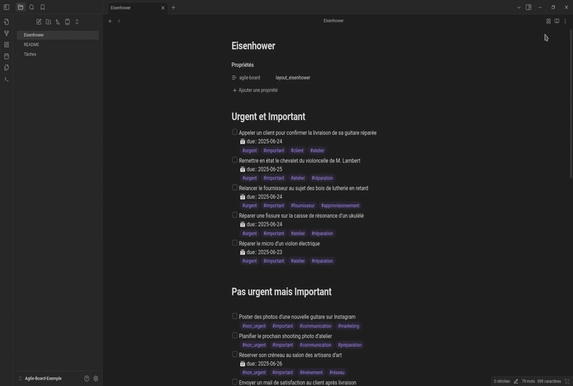

🌍 Leia isto em outros idiomas:
[English](README.md) | [Français](README.fr.md) | [Español](README.es.md) | [Deutsch](README.de.md) | [简体中文](README.zh-CN.md) | [Русский](README.ru.md)

---

# Agile Board

**Agile Board** é um plugin para [Obsidian](https://obsidian.md) que transforma as suas notas em quadros visuais.  
Cada disposição é baseada em um modelo (como a matriz Eisenhower) definido em uma grade de 24×24.  
As seções aparecem como quadros editáveis ("boxes"): você pode escrever, inserir tarefas, consultas do Dataview/Tasks, etc.

**Nota**: O conteúdo é sempre salvo em Markdown clássico sob títulos `#`, garantindo compatibilidade com todas as suas notas.

---

## 🎯 Funcionalidades

Transforme suas notas em painéis visuais com quadros editáveis.  
Cada quadro representa uma seção (título de nível 1) com suporte para:

- **Markdown avançado**: `[[links]]`, `- [ ] tarefas`, formatação
- **Edição inteligente**: listas automáticas, caixas de seleção clicáveis
- **Compatibilidade com plugins**: Dataview, Tasks, etc.
- **Visualização ao vivo**: renderização próxima ao Obsidian, com algumas limitações
- **Bloqueio de quadro**: Bloqueie qualquer quadro para evitar edições acidentais — links, embeds e caixas de seleção continuam funcionando
- **Tamanho da fonte**: Ajuste o tamanho do texto em todos os quadros (0,8× a 1,5×) nas configurações


## 🌍 Suporte multilíngue

**NOVIDADE na v0.7.7**: Internacionalização completa com **detecção automática de idioma**!

- 🇺🇸 **English** – idioma de referência  
- 🇫🇷 **Français** – tradução completa  
- 🇪🇸 **Español** – tradução completa  
- 🇩🇪 **Deutsch** – tradução completa  
- 🇵🇹 **Português** – tradução completa  
- 🇨🇳 **中文 (简体)** – 完整翻译  

A interface adapta-se automaticamente ao idioma configurado no Obsidian.  
Todos os elementos da interface, configurações, mensagens e dicas foram traduzidos com **96 chaves de tradução** em todos os idiomas.

## ⚠️ Limitações atuais

O modo quadro utiliza CodeMirror 6 para edição, mas não inclui todas as funcionalidades avançadas do Obsidian:

- **Sugestões de links**: Ao digitar `[[`, o editor não sugere as suas notas (mas ainda é possível escrever o link completo manualmente)
- **Chamadas de plugins inline**: Consultas inline do Dataview (`= this.file.name`) ou comandos do Templater (`<% tp.date.now() %>`) não são executados nos quadros

### 📎 Suporte para Embeds

**NOVO**: Pré-visualização de embeds agora é suportada no modo quadro!

- **Imagens**: `![[image.png]]` é exibida corretamente no modo de pré-visualização
- **Notas**: `![[outra-nota.md]]` renderiza o conteúdo da nota
- **Obsidian Bases**: `![[table.base]]` exibe visualizações interativas de banco de dados

**Seleção de visualização persistente para Bases**: Para tornar a seleção de visualização em uma base persistente, use a sintaxe com fragmento:
```markdown
![[table.base#NomeDaVisualizacao]]
```
Isso garante que a visualização especificada seja sempre exibida ao carregar a nota.

## 🔄 Dois modos de exibição

**🏢 Modo Quadro**: Grade de quadros editáveis com visualização ao vivo  
**📄 Modo Normal**: Edição clássica de Markdown no Obsidian  

Alterne entre os modos pelos ícones da barra de ferramentas.



### 📋 Menu contextual e impressão

Clique com o botão direito na aba do quadro para acessar todas as opções padrão do Obsidian (dividir, renomear, mover, marcar, etc.) e imprimir o seu quadro diretamente.


---

## 🚀 Instalação

### Opção 1 – BRAT (Recomendado)

Instale via [BRAT](https://github.com/TfTHacker/obsidian42-brat) para receber atualizações automáticas:

1. Instale e ative o plugin BRAT  
2. Adicione `a198h/agile-board` como plugin beta  
3. O BRAT instalará e atualizará o plugin automaticamente

### Opção 2 – Instalação manual

1. Baixe `main.js`, `manifest.json` e `styles.css` de [GitHub releases](https://github.com/a198h/agile-board/releases)  
2. Copie-os para `.obsidian/plugins/agile-board/`  
3. Reinicie o Obsidian e ative o plugin  
4. **5 disposições padrão incluídas**  

---

## 📝 Uso

### Configuração

Para habilitar uma disposição em uma nota, adicione esta linha às propriedades (frontmatter):

```yaml
---
agile-board: eisenhower
---
```

**Disposições disponíveis** (incluídas por padrão):

- `eisenhower`: matriz 4-quadrantes importante/urgente  
- `swot`: análise de situação  
- `moscow`: priorização de requisitos (Must/Should/Could/Won’t)  
- `effort_impact`: decidir ações com base em esforço x impacto  
- `cornell`: método Cornell de anotações ativas  

O ícone 🏢 aparece na barra de ferramentas. Clique para alternar para o modo quadro.

### Edição

- **Clique em um quadro** → Modo edição  
- **Listas inteligentes**: listas com marcadores e numeradas  
- **Caixas de seleção**: clique para marcar/desmarcar, sincronização automática  
- **Consultas**: Query, Dataview, Tasks  

---

## ⚙️ Configurações do plugin

Acesse **Configurações → Plugins da comunidade → Agile Board** para gerenciar suas disposições diretamente no Obsidian.


### 📋 Gestão de disposições

A lista de disposições disponíveis aparece automaticamente nas configurações.  
Cada disposição corresponde a um arquivo `.json` salvo na pasta `layouts` do plugin (os usuários não precisam editar essa pasta manualmente).

- **Criar uma disposição**: botão ➕, insira um nome  
- **Editar uma disposição**: ícone ✏️ abre o editor visual  
- **Duplicar uma disposição**: ícone 📑  
- **Exportar / Importar**: ícones ⬆️ e ⬇️ para compartilhar ou carregar configurações  
- **Excluir uma disposição**: ícone 🗑️  

### 🎨 Editor visual

O editor de disposições mostra uma **grade de 24×24**, onde você pode posicionar **quadros**:

- **Criar**: clique e arraste  
- **Mover**: arraste o quadro  
- **Redimensionar**: use os controles circulares  
- **Renomear**: modifique o título no painel lateral  
- **Excluir**: botão vermelho "🗑️"  
- **Excluir tudo**: botão vermelho "🗑️ Clear all boxes" abaixo da seção de ajuda  

Cada quadro corresponde a uma **seção da nota**: um **título de nível 1** (`#`) seguido do conteúdo.

---

## ✨ Recursos

- **Sincronização automática**: alterações nos quadros são salvas automaticamente no arquivo Markdown  
- **Seções automáticas**: criação assistida de seções ausentes  
- **Compatibilidade com plugins**: Dataview, Tasks e Templater funcionam normalmente (relate bugs!); outros plugins ainda a verificar  

---

## 💡 Inspiração

Este plugin é inspirado no [Obsidian-Templify](https://github.com/Quorafind/Obsidian-Templify) e amplia o conceito de transformar notas Markdown em disposições visuais.

---

## 📂 Sua contribuição importa!

- **Bugs/Issues**: [https://github.com/a198h/agile-board/issues](https://github.com/a198h/agile-board/issues)  
- **Discussões**: [https://github.com/a198h/agile-board/discussions/8](https://github.com/a198h/agile-board/discussions/8)  

## Apoie-me
Se você achar meu trabalho útil, pode me apoiar aqui:  
[](https://ko-fi.com/a198h)
