# Architecture du Plugin Agile Board

Ce document présente l'architecture et les relations entre les différents fichiers de la codebase du plugin Agile Board pour Obsidian.

## Diagramme d'Architecture

```mermaid
flowchart TD
    %% Légende intégrée
    subgraph LEGEND [" 📖 LÉGENDE DES COULEURS "]
        CORE_LEG["🔵 **CORE**
        Services fondamentaux"]
        SERVICE_LEG["🟣 **SERVICES**
        Logique métier"]
        RENDER_LEG["🟢 **RENDU**
        Interface visuelle"]
        VIEW_LEG["🟠 **VUES**
        Vues spécialisées"]
        TYPE_LEG["🩷 **TYPES**
        Définitions communes"]
    end

    %% Plugin principal
    A["main.ts
🔧 Class: AgileBoardPlugin
    - onload()
    - onunload()
    - initializeServices()
    - startMonitoring()
    - cleanup()"] --> B["layoutService.ts
⚙️ Class: LayoutService
    - load()
    - getModel()
    - hasModel()
    - getAllModelNames()
    - reload()"]
    A --> C["modelDetector.ts
👁️ Class: ModelDetector
    - handleFileOpen()
    - extractModelName()
    - attemptAutoSwitch()
    - markUserManualChange()
    - resetManualChanges()"]
    A --> D["agileBoardView.ts
📋 Class: AgileBoardView
    - renderBoardLayout()
    - createFrames()
    - onFrameContentChanged()
    - switchToNormalView()
    - createMissingSections()"]
    A --> E["viewSwitcher.ts
🔄 Class: ViewSwitcher
    - switchToBoardView()
    - switchToMarkdownView()
    - addSwitchButton()
    - updateSwitchButton()
    - observeToolbarChanges()"]
    A --> F["fileSynchronizer.ts
🔄 Class: FileSynchronizer
    - start()
    - stop()
    - onFileModified()
    - updateBoardView()
    - notifyBoardViewChange()"]
    A --> G["core/index.ts
📦 Class: Core Exports"]

    %% Services Layout
    B --> H["core/layout/layoutLoader.ts
📥 Class: LayoutLoader
    - loadLayouts()
    - loadIndividualLayouts()"]
    B --> I["core/errorHandler.ts
❌ Class: ErrorHandler
    - handleError()
    - displayToUser()
    - logError()"]
    B --> J["core/validation.ts
✅ Class: ValidationUtils
    - validateLayoutModel()
    - validateLayoutModelName()
    - checkGridCollisions()"]
    B --> HH1["core/layout/layoutFileRepo.ts
📁 Class: LayoutFileRepo
    - listLayouts()
    - loadLayout()
    - saveLayout()
    - deleteLayout()
    - watchFiles()"]
    B --> II1["ui/layoutSettingsTab.ts
⚙️ Class: LayoutSettingsTab
    - display()
    - refreshLayoutList()
    - openLayoutEditor()"]
    A --> LL1["settings.ts
⚙️ Class: AgileBoardSettings
    - loadSettings()
    - saveSettings()
    - getDefaults()"]
    A --> MM1["settingsTab.ts
🔧 Class: SettingsTab
    - display()
    - addGeneralSettings()
    - addLayoutSettings()"]
    
    C --> B
    
    %% Rendu
    D --> K["layoutRenderer.ts
🎨 Class: LayoutRenderer
    - renderLayout()
    - findMissingSections()
    - renderErrorOverlay()
    - resetAndInsertSections()
    - isLivePreviewMode()"]
    D --> L["sectionParser.ts
📝 Class: SectionParser
    - parseMarkdownSections()
    - extractLevelOneTitle()
    - validateRequiredSections()
    - insertMissingSections()
    - parseHeadingsInFile()"]
    K --> L
    K --> M["markdownBox.ts
✏️ Class: MarkdownBox
    - renderPreview()
    - openEditor()
    - closeEditor()
    - isInteractiveElement()"]
    
    %% Vues spécialisées
    D --> N["nativeMarkdownView.ts
📄 Class: NativeMarkdownView"]
    D --> O["embeddedMarkdownView.ts
🔗 Class: EmbeddedMarkdownView"]
    D --> P["markdownSubView.ts
📑 Class: MarkdownSubView"]
    D --> Q["simpleMarkdownFrame.ts
🖼️ Class: SimpleMarkdownFrame"]

    %% Core système
    G --> I
    G --> R["core/logger.ts
📊 Class: Logger
    - createContextLogger()
    - info()
    - debug()
    - error()
    - warn()"]
    G --> S["core/lifecycle.ts
🔄 Class: LifecycleManager
    - registerComponent()
    - initializeComponents()
    - dispose()"]
    G --> J
    G --> T["core/logging-config.ts
⚙️ Class: LoggingConfig
    - setupAutomatic()
    - addLogLevelCommands()
    - setLogLevel()"]
    G --> U["core/baseComponent.ts
🏗️ Class: BaseComponent
    - onLoad()
    - onUnload()"]
    
    H --> V["core/layout/layoutValidator.ts
✅ Class: LayoutValidator
    - validateModel()
    - validateBlock()
    - checkBounds()"]
    HH1 --> JJ1["core/layout/layoutValidator24.ts
✅ Class: LayoutValidator24
    - validateLayout()
    - wouldCollide()
    - findFreePosition()"]
    II1 --> KK1["ui/layoutEditor.ts
🎨 Class: LayoutEditor
    - setupUI()
    - renderLayout()
    - createBoxElement()
    - handleDrag()
    - saveLayout()"]
    
    %% DOM
    G --> W["core/dom/index.ts
🌐 Class: DOM Exports"]
    W --> X["core/dom/elementFactory.ts
🏭 Class: ElementFactory
    - createElement()
    - createContainer()"]
    W --> Y["core/dom/dimensionManager.ts
📏 Class: DimensionManager
    - calculateDimensions()
    - getGridPosition()"]
    
    %% Composants
    G --> Z["core/components/index.ts
🧩 Class: Components Exports"]
    Z --> AA["core/components/markdownEditor.ts
✏️ Class: MarkdownEditor
    - initialize()
    - updateContent()"]
    Z --> BB["core/components/markdownPreview.ts
👁️ Class: MarkdownPreview
    - render()
    - refresh()"]
    Z --> CC["core/components/embedRenderer.ts
🔗 Class: EmbedRenderer
    - renderEmbed()
    - handleLinks()"]
    Z --> DD["core/components/taskManager.ts
📋 Class: TaskManager
    - createTask()
    - updateTask()"]
    
    %% Business
    G --> EE["core/business/index.ts
💼 Class: Business Exports"]
    EE --> FF["core/business/markdownProcessor.ts
⚙️ Class: MarkdownProcessor
    - processContent()
    - extractMetadata()"]
    EE --> GG["core/business/gridCalculator.ts
📐 Class: GridCalculator
    - calculateGridLayout()
    - optimizePositions()"]
    
    %% Types
    HH["types.ts
📋 Class: Type Definitions
    - LayoutModel
    - SectionInfo
    - PluginError
    - ValidationResult
    - FileDetectionState"] -.-> A
    HH -.-> B
    HH -.-> C
    HH -.-> K
    HH -.-> L
    HH -.-> H
    HH -.-> V

    %% Styles pour les couches
    classDef coreLayer fill:#e1f5fe,stroke:#0277bd,stroke-width:2px
    classDef serviceLayer fill:#f3e5f5,stroke:#7b1fa2,stroke-width:2px
    classDef renderLayer fill:#e8f5e8,stroke:#388e3c,stroke-width:2px
    classDef viewLayer fill:#fff3e0,stroke:#f57c00,stroke-width:2px
    classDef typeLayer fill:#fce4ec,stroke:#c2185b,stroke-width:2px
    classDef legendStyle fill:#f8f9fa,stroke:#6c757d,stroke-width:1px

    %% Application des styles
    class A,G,I,R,S,J,T,U,W,X,Y,Z,AA,BB,CC,DD,EE,FF,GG,LL1 coreLayer
    class B,C,E,F,H,V,HH1,JJ1 serviceLayer
    class K,M,KK1 renderLayer
    class D,N,O,P,Q,II1,MM1 viewLayer
    class HH,L typeLayer
    class LEGEND,CORE_LEG,SERVICE_LEG,RENDER_LEG,VIEW_LEG,TYPE_LEG legendStyle
```



## Légende des Couleurs

| Couleur | Couche | Description |
|---------|--------|-------------|
| 🔵 **Bleu** | **Core** | Services fondamentaux (logging, erreurs, validation, DOM) |
| 🟣 **Violet** | **Services** | Logique métier (layout, détection, synchronisation) |
| 🟢 **Vert** | **Rendu** | Interface visuelle (renderer, éditeur inline) |
| 🟠 **Orange** | **Vues** | Vues Obsidian spécialisées (Board, Markdown) |
| 🩷 **Rose** | **Types** | Définitions communes (types, parsing) |

## Description des Composants Principaux

### 🔧 Plugin Principal (A)
- **main.ts** - Point d'entrée orchestrant tous les services
- Méthodes clés : `onload()`, `initializeServices()`, `startMonitoring()`

### ⚙️ Services Métier (B-F, H, V, HH1, JJ1)
- **LayoutService (B)** - Gestion des modèles de layout
- **ModelDetector (C)** - Détection automatique des fichiers avec layout
- **AgileBoardView (D)** - Vue principale du plugin
- **ViewSwitcher (E)** - Basculement entre vues Board et Markdown
- **FileSynchronizer (F)** - Synchronisation en temps réel
- **LayoutLoader (H)** - Chargement depuis fichiers individuels `/layouts/`
- **LayoutValidator (V)** - Validation des modèles (legacy)
- **LayoutFileRepo (HH1)** - Repository pour gestion CRUD des layouts
- **LayoutValidator24 (JJ1)** - Validation optimisée grille 24x24

### 🎨 Rendu et Interface (K, M, KK1)
- **LayoutRenderer (K)** - Rendu de la grille visuelle
- **MarkdownBox (M)** - Composant d'édition inline avec prévisualisation
- **LayoutEditor (KK1)** - Éditeur visuel drag & drop pour créer/modifier layouts

### 🏗️ Infrastructure Core (G, I, R, S, J, T-GG, LL1)
- **ErrorHandler (I)** - Gestion centralisée des erreurs
- **Logger (R)** - Système de logging contextualisé
- **LifecycleManager (S)** - Gestion du cycle de vie des composants
- **ValidationUtils (J)** - Utilitaires de validation
- **DOM Factory (X)** - Création d'éléments DOM
- **Business Logic (FF, GG)** - Processeurs et calculateurs métier
- **AgileBoardSettings (LL1)** - Système de configuration du plugin

### 📋 Types et Utilitaires (HH, L)
- **types.ts (HH)** - Définitions TypeScript communes
- **sectionParser.ts (L)** - Parsing des sections Markdown

### 🖼️ Vues Spécialisées (N-Q, II1, MM1)
- **NativeMarkdownView (N-Q)** - Différentes implémentations de vues Markdown
- **LayoutSettingsTab (II1)** - Onglet paramètres pour gestion des layouts
- **SettingsTab (MM1)** - Interface de configuration générale du plugin

## 🚀 Points d'Entrée Principaux

1. **main.ts** - Point d'entrée du plugin, orchestre tous les services via `onload()`
2. **agileBoardView.ts** - Vue principale qui gère l'affichage des boards via `renderBoardLayout()`
3. **layoutService.ts** - Service central de gestion des layouts via `load()` et `getModel()`
4. **modelDetector.ts** - Détection automatique des notes avec layouts via `handleFileOpen()`

## 🔄 Flux de Données Détaillé

### 1. **Initialisation** (🔧 main.ts)
```
onload() → initializeServices() → startMonitoring()
├── AgileBoardSettings.loadSettings() - Charge la configuration
├── LayoutService.load() - Charge layouts depuis /layouts/
├── ModelDetector.onLoad() - Active la surveillance
├── ViewSwitcher.addSwitchButton() - Ajoute boutons
└── FileSynchronizer.start() - Lance sync fichiers
```

### 2. **Détection Automatique** (👁️ ModelDetector)
```
Fichier ouvert → handleFileOpen()
├── extractModelName() - Lit frontmatter agile-board
├── shouldAutoSwitch() - Vérifie conditions
└── attemptAutoSwitch() - Bascule vers Board View
```

### 3. **Rendu Board** (📋 AgileBoardView)
```
renderBoardLayout()
├── LayoutService.getModel() - Récupère modèle
├── parseHeadingsInFile() - Parse sections
├── createGrid() - Crée grille CSS
└── createFrames() - Crée frames éditables
```

### 4. **Édition Inline** (✏️ MarkdownBox)
```
Clic → openEditor()
├── User Edit → input event
├── renderPreview() - Live preview
└── closeEditor() → onChange() → FileSynchronizer
```

### 5. **Synchronisation** (🔄 FileSynchronizer)
```
Fichier modifié → onFileModified()
├── getBoardViewForFile() - Trouve vue Board
├── parseHeadingsInFile() - Parse nouveau contenu
└── updateBoardView() - Met à jour frames
```

### 6. **Gestion des Layouts** (⚙️ LayoutSettingsTab)
```
Paramètres → LayoutSettingsTab.display()
├── listLayouts() - Liste layouts disponibles
├── openLayoutEditor() - Ouvre éditeur visuel
├── LayoutEditor.setupUI() - Interface drag & drop
├── saveLayout() - Sauvegarde layout.json individuel
└── LayoutFileRepo.watchFiles() - Hot-reload
```

### 7. **Création/Édition Visuelle** (🎨 LayoutEditor)
```
Nouveau Layout → LayoutEditor.onOpen()
├── setupGrid() - Grille 24x24 avec numérotation
├── createBoxElement() - Créer/modifier boxes
├── handleDrag() - Drag & drop + redimensionnement
├── LayoutValidator24.validateLayout() - Validation en temps réel
└── saveLayout() - Génère fichier /layouts/nom.json
```

## 🎯 Interactions Clés

**🔄 Cycle Principal**
- **Configuration** : AgileBoardSettings gère les préférences utilisateur
- **Détection** : ModelDetector surveille les fichiers et frontmatter
- **Basculement** : ViewSwitcher gère les transitions entre vues
- **Rendu** : LayoutRenderer + MarkdownBox affichent la grille éditable
- **Synchronisation** : FileSynchronizer maintient la cohérence
- **Gestion Layouts** : LayoutFileRepo + LayoutEditor permettent CRUD visuel

**⚡ Événements Temps Réel**
- Modification fichier → Mise à jour automatique des frames
- Changement frontmatter → Re-détection du modèle
- Édition inline → Sauvegarde immédiate + sync autres vues
- Création/modification layout → Hot-reload automatique
- Drag & drop dans éditeur → Validation en temps réel des collisions

**🎨 Nouveautés Architecture**
- **Système de fichiers individuels** : Chaque layout = 1 fichier `/layouts/nom.json`
- **Éditeur visuel drag & drop** : Création/modification layouts sans code
- **Validation grille 24x24** : Prévention collisions + optimisation positions
- **Hot-reload layouts** : Modifications prises en compte instantanément
- **Interface de gestion** : CRUD layouts via onglet paramètres dédié

---

*Généré automatiquement à partir de l'analyse de la codebase Agile Board*